# UML设计图文档

## 1. 系统类图 (System Class Diagram)

### 1.1 完整系统类图

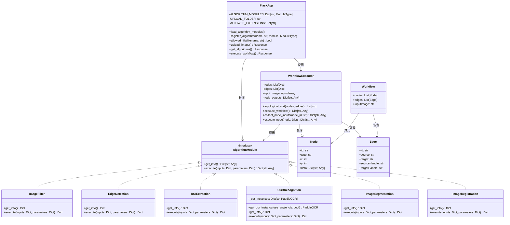

## 2. 前端类图 (Frontend Class Diagram)

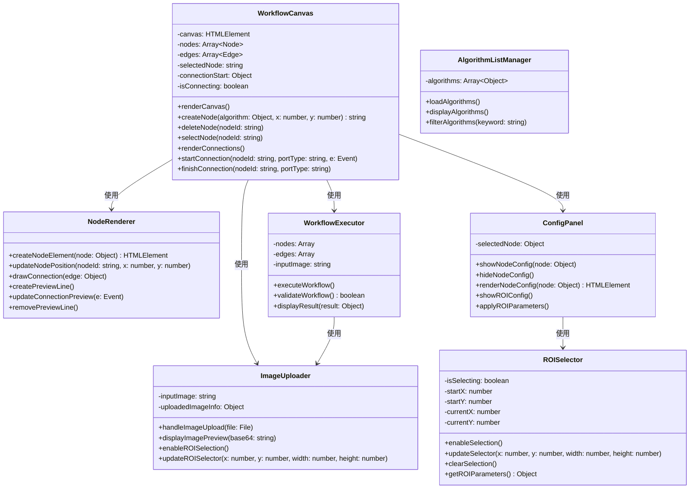

## 3. 组件图 (Component Diagram)

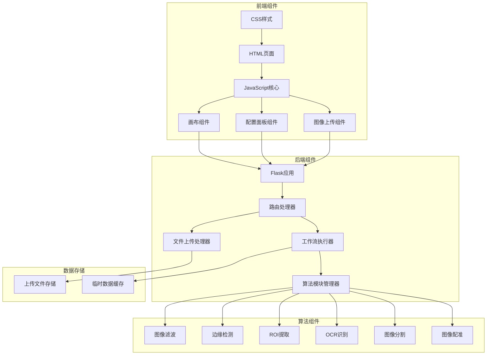

## 4. 部署图 (Deployment Diagram)

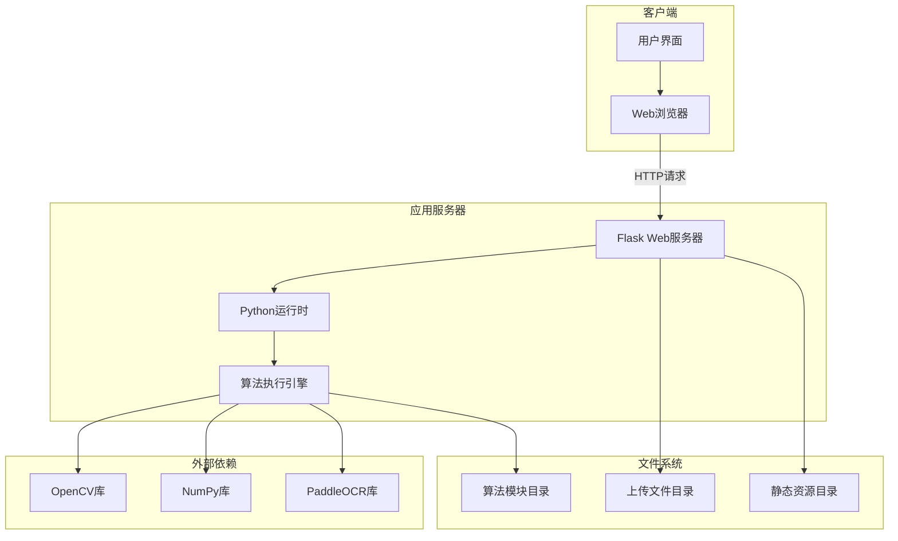

## 5. 状态图 (State Diagram)

### 5.1 节点状态图

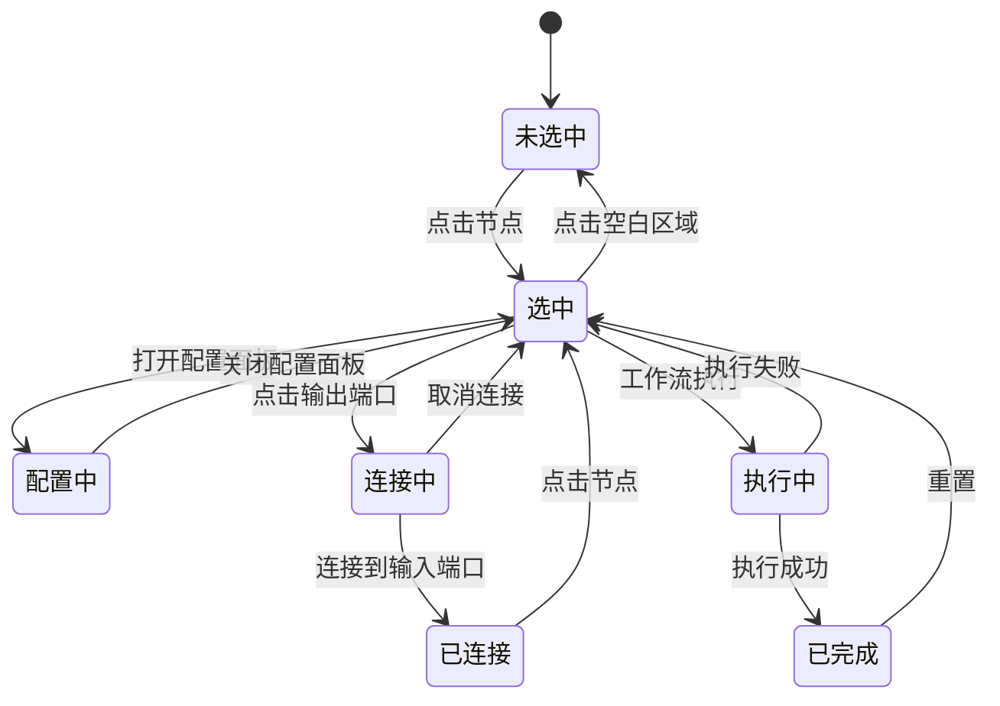

### 5.2 工作流执行状态图

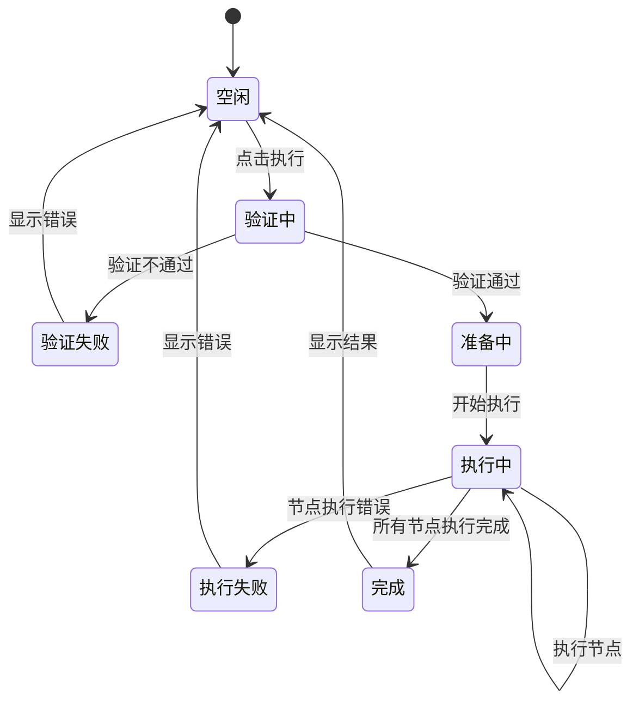

## 6. 活动图 (Activity Diagram)

### 6.1 完整工作流执行活动图

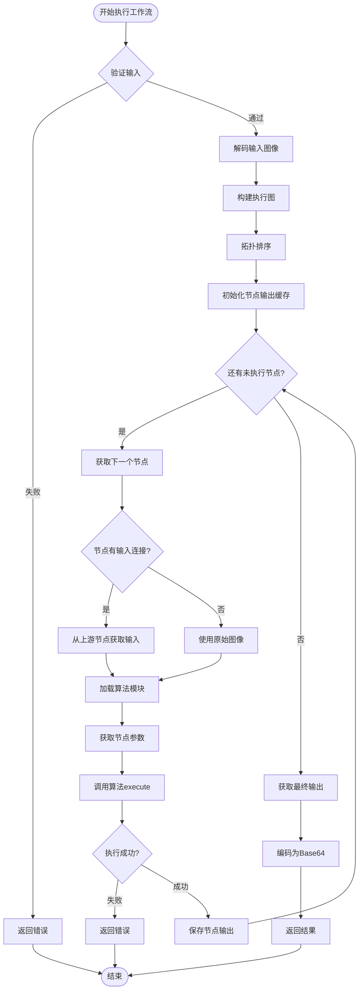

### 6.2 节点创建活动图

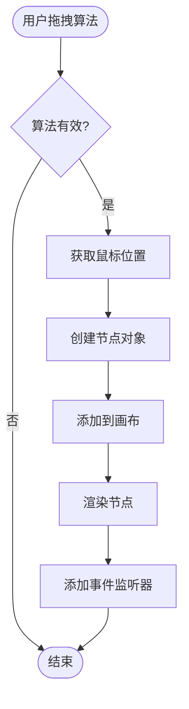

## 7. 序列图详细版

### 7.1 算法模块加载序列图

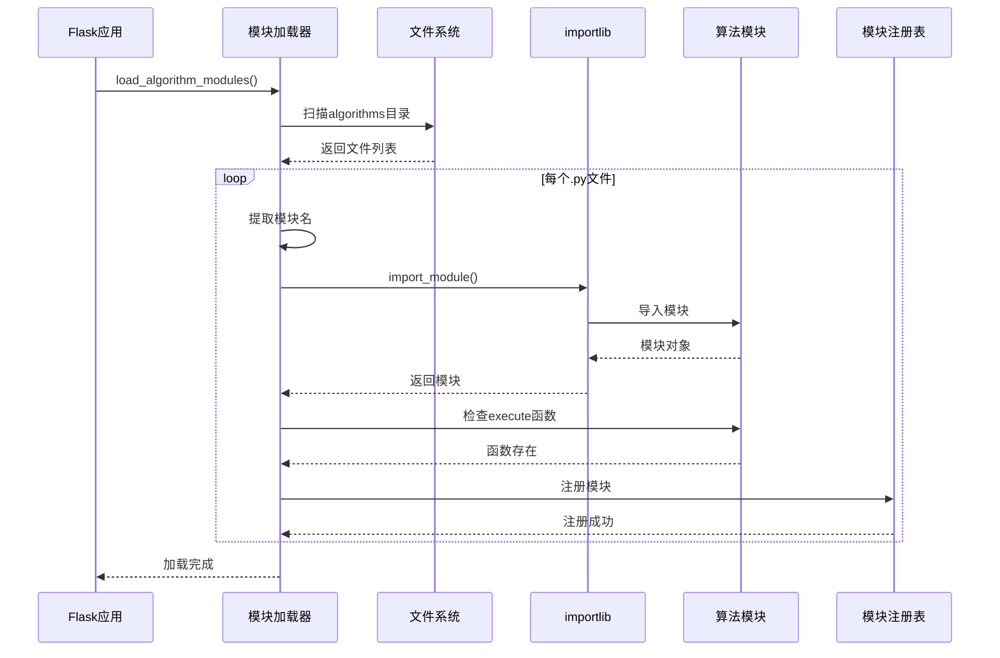

### 7.2 ROI配置序列图

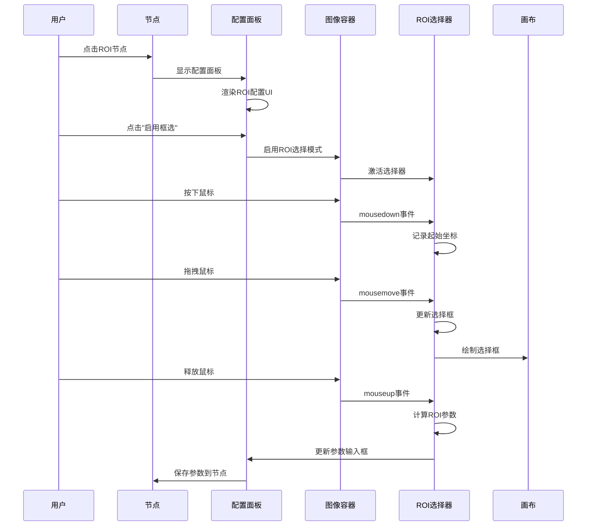

## 8. 包图 (Package Diagram)

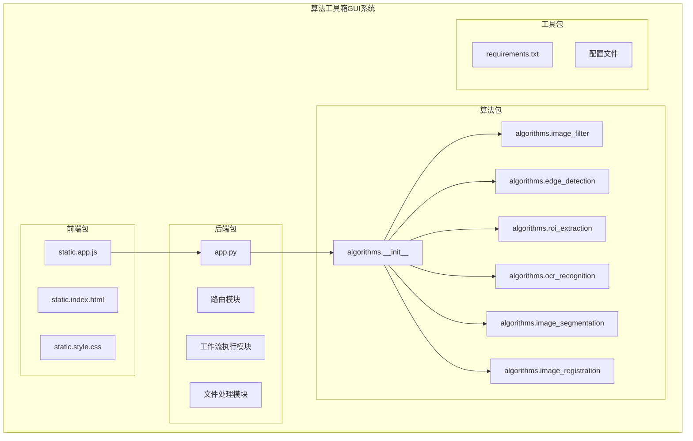

## 9. 交互图 (Interaction Diagram)

### 9.1 多节点工作流交互图

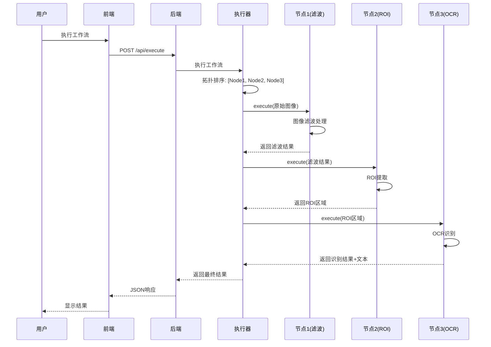

## 10. 数据模型图 (Data Model Diagram)

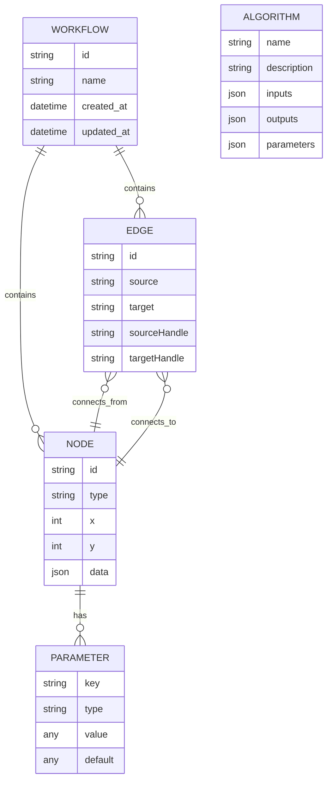

---

**文档版本**: v1.0  
**最后更新**: 2024-12-01

