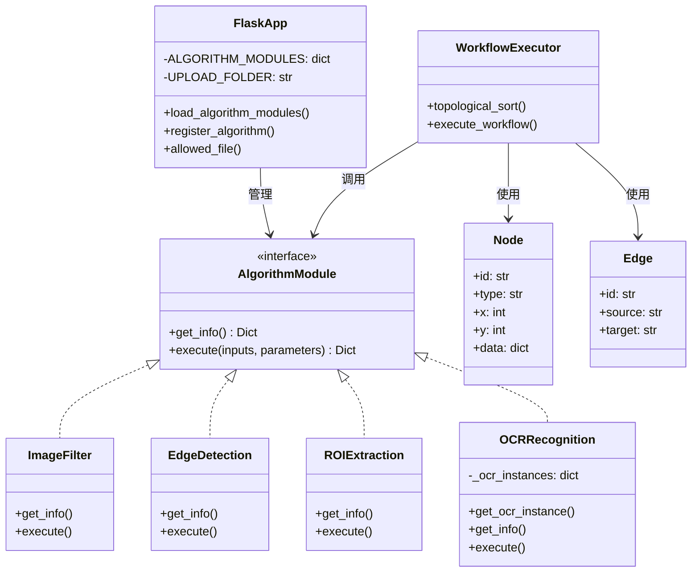
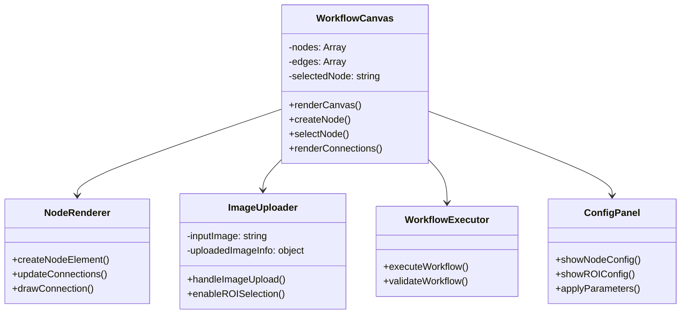
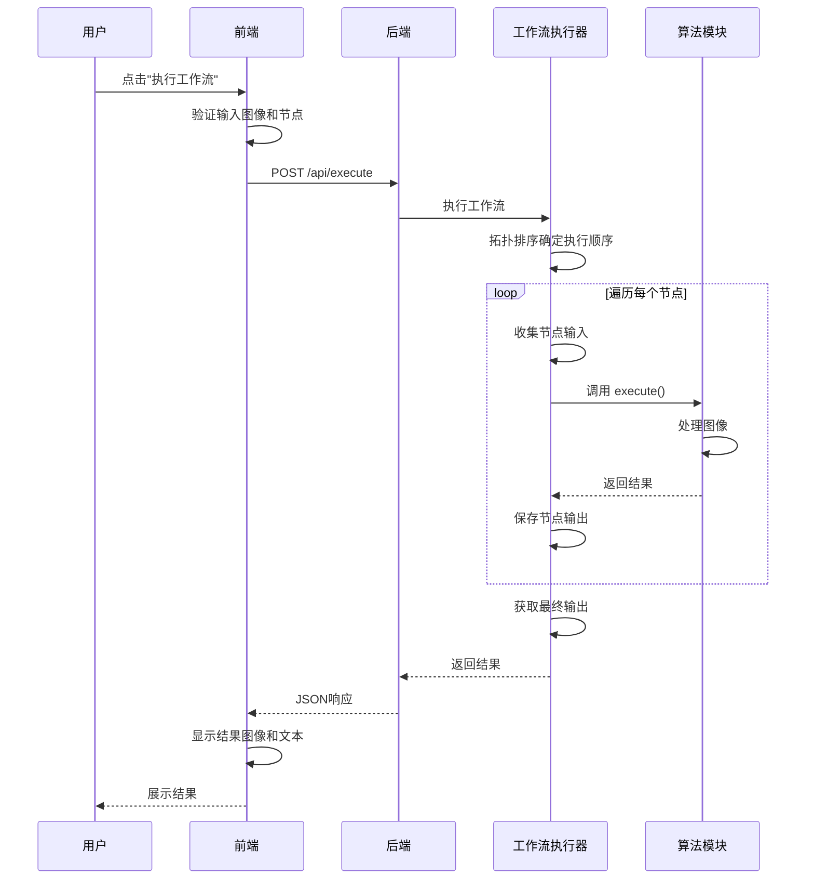
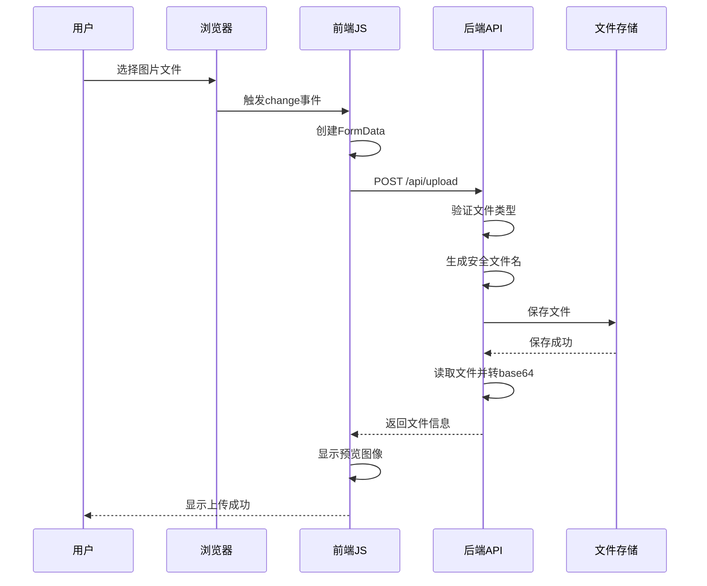
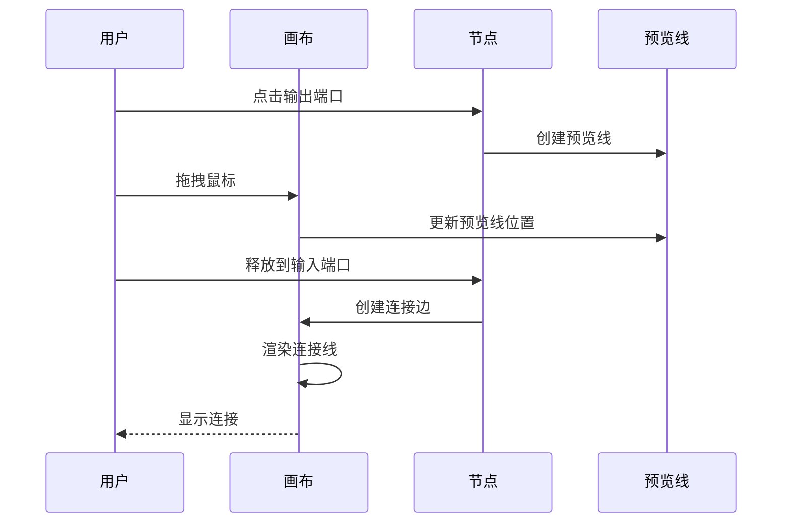
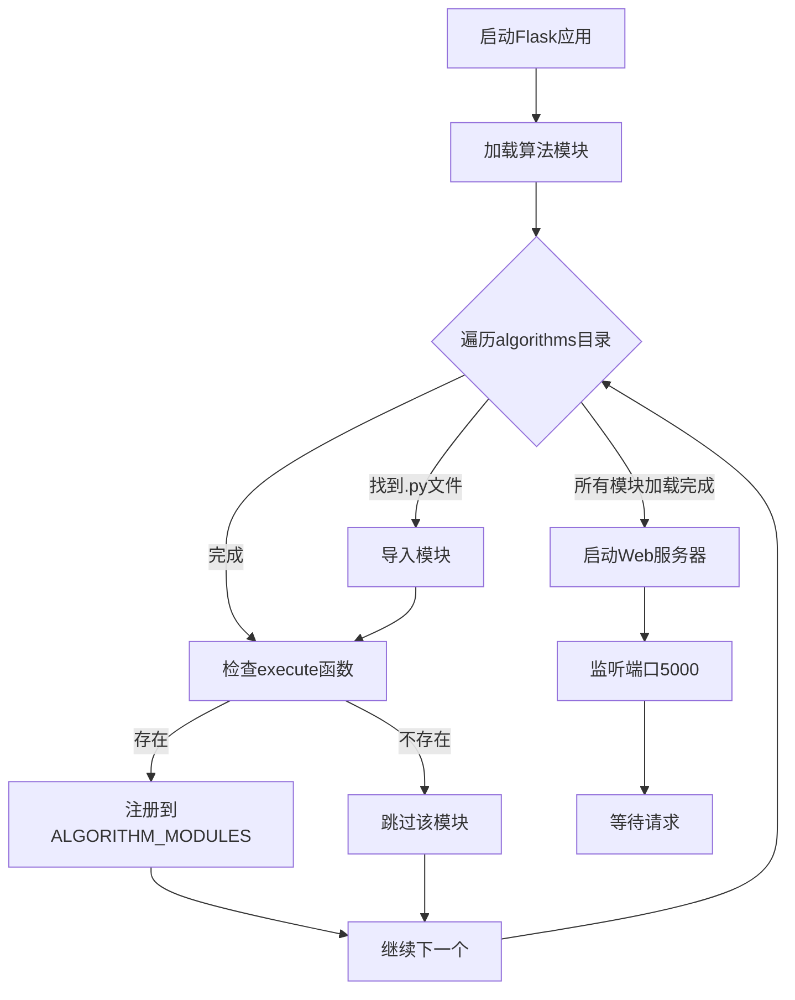
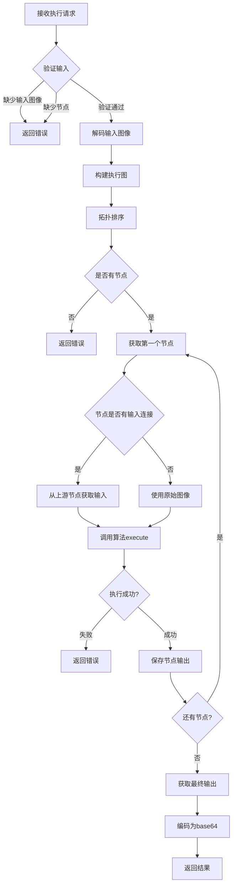
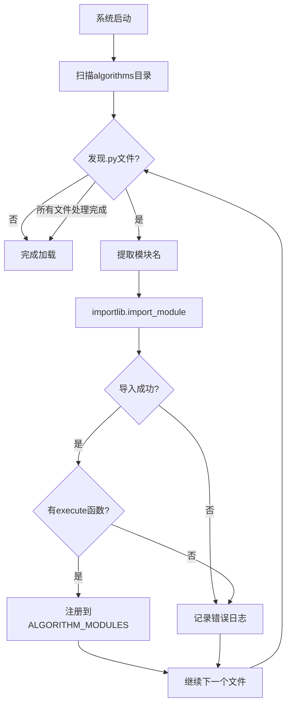
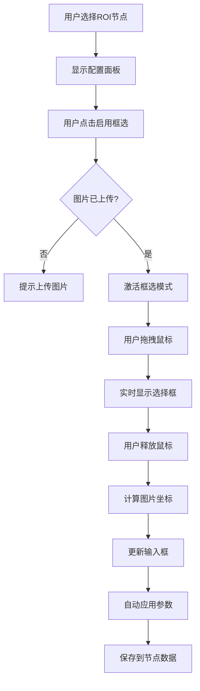

# 工业质检算法组合平台 - 架构设计文档

## 1. 系统概述

### 1.1 系统简介
工业质检算法组合平台是一个基于Web的可视化算法编排系统，支持通过拖拽方式组合不同的图像处理算法，构建复杂的工作流。

### 1.2 技术栈
- **后端框架**: Flask (Python)
- **前端技术**: HTML5, CSS3, JavaScript (原生)
- **图像处理**: OpenCV, NumPy, PIL
- **OCR识别**: PaddleOCR
- **通信协议**: RESTful API, JSON

### 1.3 系统架构
```
┌─────────────────────────────────────────────────────────┐
│                     前端层 (Frontend)                     │
│  ┌──────────┐  ┌──────────┐  ┌──────────┐  ┌──────────┐ │
│  │   HTML   │  │   CSS    │  │    JS    │  │  Canvas │ │
│  │  页面    │  │  样式    │  │  逻辑    │  │  画布   │ │
│  └──────────┘  └──────────┘  └──────────┘  └──────────┘ │
└──────────────────────┬──────────────────────────────────┘
                       │ HTTP/REST API
┌──────────────────────▼──────────────────────────────────┐
│                   后端层 (Backend)                       │
│  ┌──────────────────────────────────────────────────┐  │
│  │              Flask 应用服务器                      │  │
│  │  ┌──────────┐  ┌──────────┐  ┌──────────┐        │  │
│  │  │ 路由管理 │  │ 文件上传 │  │ 工作流  │        │  │
│  │  │          │  │ 处理    │  │ 执行    │        │  │
│  │  └──────────┘  └──────────┘  └──────────┘        │  │
│  └──────────────────────────────────────────────────┘  │
│                       │                                  │
│  ┌────────────────────▼──────────────────────────────┐  │
│  │           算法模块管理器                           │  │
│  │  ┌──────────┐  ┌──────────┐  ┌──────────┐        │  │
│  │  │ 模块加载 │  │ 模块注册 │  │ 模块调用 │        │  │
│  │  └──────────┘  └──────────┘  └──────────┘        │  │
│  └──────────────────────────────────────────────────┘  │
└──────────────────────┬──────────────────────────────────┘
                       │
┌──────────────────────▼──────────────────────────────────┐
│                 算法层 (Algorithms)                      │
│  ┌──────────┐  ┌──────────┐  ┌──────────┐  ┌──────────┐ │
│  │ 图像滤波 │  │ 边缘检测 │  │ ROI提取  │  │ OCR识别  │ │
│  │ 图像分割 │  │ 图像配准 │  │  ...    │  │  ...    │ │
│  └──────────┘  └──────────┘  └──────────┘  └──────────┘ │
└─────────────────────────────────────────────────────────┘
```

## 2. 系统架构设计

### 2.1 分层架构

#### 2.1.1 表现层 (Presentation Layer)
- **职责**: 用户界面展示和交互
- **组件**: 
  - `index.html`: 页面结构
  - `style.css`: 样式定义
  - `app.js`: 业务逻辑和交互

#### 2.1.2 应用层 (Application Layer)
- **职责**: 业务逻辑处理和API服务
- **组件**: 
  - `app.py`: Flask应用主文件
  - API路由处理
  - 工作流执行引擎

#### 2.1.3 算法层 (Algorithm Layer)
- **职责**: 图像处理算法实现
- **组件**: 
  - `algorithms/`: 算法模块目录
  - 各算法模块的 `execute()` 函数

#### 2.1.4 数据层 (Data Layer)
- **职责**: 文件存储和管理
- **组件**: 
  - `uploads/`: 上传文件存储
  - 临时文件管理

## 3. 类图设计

### 3.1 系统类图



### 3.2 前端类图



## 4. 时序图

### 4.1 工作流执行时序图



### 4.2 图片上传时序图



### 4.3 节点连接时序图



## 5. 流程图

### 5.1 系统初始化流程



### 5.2 工作流执行流程



### 5.3 算法模块加载流程



### 5.4 ROI配置流程



## 6. 模块设计

### 6.1 后端模块

#### 6.1.1 Flask应用模块 (app.py)
**职责**:
- HTTP请求处理
- 路由管理
- 文件上传处理
- 工作流执行协调

**主要函数**:
- `load_algorithm_modules()`: 动态加载算法模块
- `upload_image()`: 处理图片上传
- `execute_workflow()`: 执行工作流
- `topological_sort()`: 拓扑排序确定执行顺序

#### 6.1.2 算法模块接口
**标准接口**:
```python
def get_info() -> Dict[str, Any]:
    """返回算法信息"""
    return {
        'name': str,
        'description': str,
        'inputs': List[str],
        'outputs': List[str],
        'parameters': Dict[str, Dict]
    }

def execute(inputs: Dict[str, Any], 
           parameters: Dict[str, Any]) -> Dict[str, Any]:
    """执行算法"""
    return {
        'image': np.ndarray,
        'output': np.ndarray,
        # 其他输出字段
    }
```

### 6.2 前端模块

#### 6.2.1 画布管理模块
**职责**:
- 节点渲染和管理
- 连接线绘制
- 拖拽交互

**主要函数**:
- `renderCanvas()`: 渲染画布
- `createNode()`: 创建节点
- `renderConnections()`: 渲染连接线

#### 6.2.2 工作流执行模块
**职责**:
- 工作流验证
- API调用
- 结果展示

**主要函数**:
- `executeWorkflow()`: 执行工作流
- `validateWorkflow()`: 验证工作流

#### 6.2.3 配置管理模块
**职责**:
- 节点参数配置
- ROI区域选择
- 参数应用

**主要函数**:
- `showNodeConfig()`: 显示配置面板
- `showROIConfig()`: 显示ROI配置
- `applyROIParams()`: 应用ROI参数

## 7. 数据流设计

### 7.1 图像数据流

```
用户上传图片
    ↓
Base64编码
    ↓
前端存储 (inputImage变量)
    ↓
工作流执行请求 (JSON)
    ↓
后端解码 (PIL Image → NumPy Array)
    ↓
算法处理 (NumPy Array)
    ↓
结果编码 (NumPy Array → Base64)
    ↓
前端显示
```

### 7.2 工作流数据流

```
节点定义 (JSON)
    ↓
拓扑排序
    ↓
执行顺序列表
    ↓
遍历执行
    ↓
节点输出缓存 (node_outputs)
    ↓
最终输出提取
    ↓
结果返回
```

## 8. API设计

### 8.1 RESTful API接口

| 方法 | 路径 | 说明 | 请求体 | 响应 |
|------|------|------|--------|------|
| GET | `/` | 主页面 | - | HTML |
| GET | `/api/algorithms` | 获取算法列表 | - | JSON |
| POST | `/api/upload` | 上传图片 | FormData | JSON |
| POST | `/api/execute` | 执行工作流 | JSON | JSON |
| GET | `/uploads/<filename>` | 获取上传文件 | - | 文件 |

### 8.2 请求/响应格式

#### 8.2.1 上传图片请求
```json
FormData {
    "file": File对象
}
```

#### 8.2.2 上传图片响应
```json
{
    "success": true,
    "filename": "20251201_010000_image.jpg",
    "filepath": "/path/to/uploads/...",
    "url": "/uploads/...",
    "base64": "data:image/jpeg;base64,...",
    "size": 123456
}
```

#### 8.2.3 执行工作流请求
```json
{
    "nodes": [
        {
            "id": "node_123",
            "type": "image_filter",
            "x": 100,
            "y": 200,
            "data": {
                "name": "图像滤波",
                "parameters": {
                    "filter_type": "gaussian",
                    "kernel_size": 5
                }
            }
        }
    ],
    "edges": [
        {
            "id": "edge_123",
            "source": "node_123",
            "target": "node_456",
            "sourceHandle": "output",
            "targetHandle": "input"
        }
    ],
    "inputImage": "data:image/jpeg;base64,..."
}
```

#### 8.2.4 执行工作流响应
```json
{
    "success": true,
    "result": "data:image/png;base64,...",
    "text": "OCR识别结果文本（可选）"
}
```

## 9. 算法模块设计模式

### 9.1 策略模式 (Strategy Pattern)
每个算法模块实现统一的接口，可以动态替换和扩展。

### 9.2 工厂模式 (Factory Pattern)
通过 `load_algorithm_modules()` 动态加载和创建算法实例。

### 9.3 单例模式 (Singleton Pattern)
OCR识别模块使用单例模式管理OCR实例，避免重复初始化。

## 10. 安全设计

### 10.1 文件上传安全
- 文件类型验证
- 文件名安全处理 (`secure_filename`)
- 文件大小限制 (16MB)
- 时间戳前缀防止文件名冲突

### 10.2 输入验证
- 参数类型检查
- 数值范围验证
- 图像格式验证

## 11. 性能优化

### 11.1 前端优化
- 节点和连接线缓存渲染
- 事件委托减少监听器
- 防抖处理用户交互

### 11.2 后端优化
- 算法模块延迟加载
- OCR实例单例复用
- 图像处理使用NumPy向量化操作

## 12. 扩展性设计

### 12.1 算法模块扩展
1. 在 `algorithms/` 目录下创建新的 `.py` 文件
2. 实现 `get_info()` 和 `execute()` 函数
3. 系统自动加载新模块

### 12.2 前端功能扩展
- 模块化JavaScript代码
- 配置面板可扩展
- 支持自定义参数类型

## 13. 部署架构

```
┌─────────────┐
│   用户浏览器 │
└──────┬──────┘
       │ HTTP
┌──────▼──────┐
│  Flask服务器 │
│  (app.py)   │
└──────┬──────┘
       │
┌──────▼──────┐
│ 算法模块目录 │
│ (algorithms)│
└──────┬──────┘
       │
┌──────▼──────┐
│  文件存储    │
│  (uploads)  │
└─────────────┘
```

## 14. 技术选型说明

### 14.1 后端框架选择
- **Flask**: 轻量级，易于扩展，适合中小型项目
- **RESTful API**: 前后端分离，便于维护

### 14.2 前端技术选择
- **原生JavaScript**: 无框架依赖，性能好，体积小
- **Canvas/SVG**: 用于节点和连接线渲染

### 14.3 图像处理库
- **OpenCV**: 强大的图像处理能力
- **NumPy**: 高效的数组操作
- **PIL/Pillow**: 图像格式转换

## 15. 未来扩展方向

1. **算法市场**: 支持算法插件市场，用户可下载新算法
2. **工作流保存**: 支持保存和加载工作流配置
3. **批量处理**: 支持批量图片处理
4. **GPU加速**: 支持GPU加速的图像处理
5. **分布式执行**: 支持分布式算法执行
6. **版本管理**: 工作流版本控制和回滚

---

**文档版本**: v1.0  
**最后更新**: 2024-12-01  
**维护者**: 开发团队

